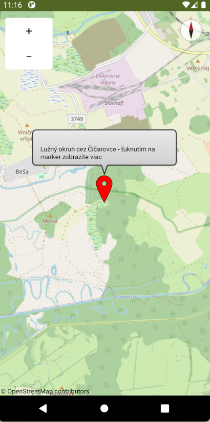
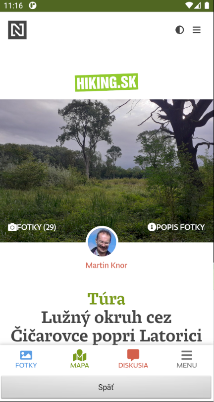

# ATIK-KnowIT-VelkeKapusany
Github repozitár pre súbory týkajuce sa ATIK - KnowIT projektu
 Dokumentácia dostupná v main branchy repozitára

 Názorná ukážka aplikácie pre OS Android v prostredí App Inventor 2, ktorá obsahuje funkcie:
-     - Mapa, na ktorej budu markerami vytvorené turistické mapy,
-     - Možnosť zobraziť informácie a názov jednotlivých turistických map,
-     - Možnosť navigovať k bodu začiatku mapy.

 Pre inicializáciu bol importovaný bod: Lužný okruh cez Čičarovce so súradnicami: N48.50976° E22.05451°
- Projekt je dostupný na adrese: https://gallery.appinventor.mit.edu/?galleryid=092141f4-82e6-453f-bdcd-2e44554ef172
 [odtiaľ si je možné projekt naklonovať na svoje konto a pokračovať v developmente]

- Ukážka:
  
  
    
